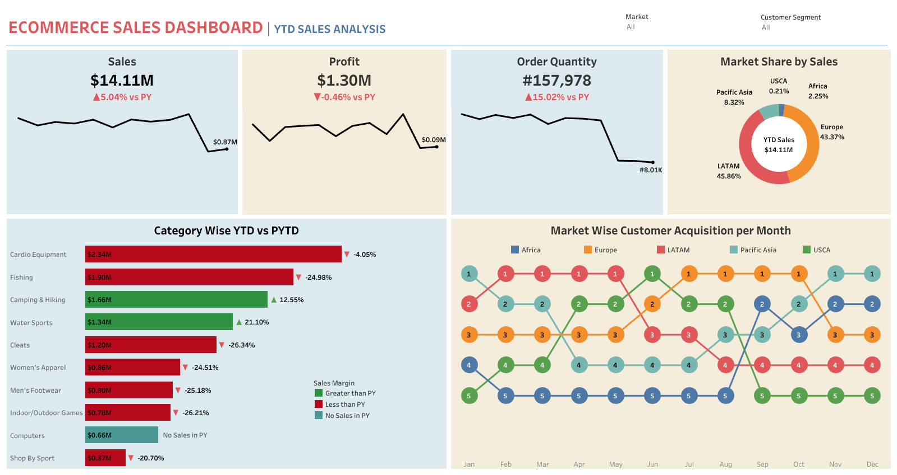

# 📊 Dataco E-Commerce — Sales Analytics Dashboard (Tableau)


> Interactive Tableau dashboards that transform Dataco e-commerce transaction data into actionable business insights—sales, customers, products, and geography.

[Overview](#-overview) · [Dashboards](#-dashboards) · [Project Structure](#-project-structure) · [Getting Started](#-getting-started) · [Documentation](#-documentation)

---

## 📋 Overview

### 🎯 Problem Statement

> E-commerce teams need a 360° view of sales performance, customer behavior, and product trends. Static reports don't support drill-down, geographic exploration, or self-serve analysis.

### 💡 Solution

A **comprehensive Tableau visualization project** that:

- Transforms raw e-commerce transaction data into interactive dashboards
- Provides revenue, profit, sales trends, customer segmentation, and geographic performance
- Uses **calculated fields**, **LOD expressions**, **parameters**, and **dashboard actions**
- Follows data viz best practices for clarity, accessibility, and actionable insights

### ✨ Key Features

| Feature | Description |
|---------|-------------|
| 📈 **Sales performance** | Revenue, profit margins, YoY growth, sales trends by period and category |
| 🌍 **Geographic analysis** | Maps by region, state, city; drill-down with color and size encoding |
| 📦 **Product insights** | Category/subcategory performance; treemaps, heat maps, top products |
| 👥 **Customer analytics** | Segmentation, acquisition, retention, lifetime value |
| 📅 **Temporal analysis** | Day/week/month/quarter/year; seasonal patterns and period comparisons |
| 🔧 **Interactive filters** | Date ranges, categories, regions, parameters, cross-filtering |

### 👥 Target Audience

- **Recruiters** — Evidence of Tableau, LOD, calculated fields, and dashboard design
- **Business analysts** — Sales and customer insights
- **BI / data engineers** — Clean structure and viz best practices

---

## 📊 Dashboards

### 📈 Sales Performance Analysis

Revenue, profit margins, and sales trends with interactive filters. YoY comparisons, growth rates, and performance by category and region.

### 🌍 Geographic Analysis

Interactive maps: country → state → city drill-down. Color and size encode sales volume and performance metrics.

### 📦 Product Category Insights

Bar charts, treemaps, and heat maps for category/subcategory performance. Top products, underperformers, and product mix optimization.

### 🖼️ Dashboard Preview



---

## 🛠️ Tech Stack & Advanced Features

### Technology

| Component | Technology |
|-----------|------------|
| **Visualization** | Tableau Desktop |
| **Publishing** | Tableau Public |
| **Data format** | CSV |
| **Calculations** | Calculated fields, LOD expressions, table calculations |

### 🔧 Advanced Tableau Features

| Feature | Use Case |
|---------|----------|
| **Calculated fields** | YoY growth, profit margins, conditional formatting |
| **LOD expressions** | Fixed/Include/Exclude for complex aggregations |
| **Table calculations** | Running totals, % of total, moving averages, rank |
| **Parameters** | Date range, metric selectors, comparison periods |
| **Dashboard actions** | Cross-filtering, highlighting, sheet navigation |

---

## 📁 Project Structure

```
dataco-ecommerce-analytics-visualization-tableau/
├── data/
│   └── raw/
│       └── dataco_db.csv              # E-commerce transaction data
├── assets/
│   ├── dashboards/
│   │   └── ecommerce_sales_dashboard.twb
│   └── images/
│       └── _ecommerce_sales_dashboard.png
├── README.md
└── .gitignore
```

### 📂 Folder Descriptions

| Folder | Purpose |
|--------|---------|
| `data/raw/` | Source dataset (Dataco e-commerce transactions) |
| `assets/dashboards/` | Tableau workbook (.twb) |
| `assets/images/` | Dashboard preview image |

---

## 🚀 Getting Started

### Prerequisites

- **Tableau Desktop** or **Tableau Public**
- Data file: `data/raw/dataco_db.csv`

### Quick Start

1. **Clone the repo**
   ```bash
   git clone https://github.com/Konstant-gk/dataco-ecommerce-analytics-visualization-tableau.git
   cd dataco-ecommerce-analytics-visualization-tableau
   ```

2. **Open the workbook**
   - Open `assets/dashboards/ecommerce_sales_dashboard.twb` in Tableau
   - If prompted, point the data source to `data/raw/dataco_db.csv`

3. **Refresh data** (optional)
   - Data → [data source] → Refresh

### 🌐 Dashboard Access

The interactive dashboard is published on **Tableau Public**:

**[Dataco E-Commerce Visualization Dashboard](https://public.tableau.com/)** — *add your Tableau Public link here*

---

## 📈 Key Metrics & KPIs

| Metric | Description |
|--------|-------------|
| **Revenue** | Total sales, revenue by period, YoY growth |
| **Profitability** | Profit margins, profit by category, trends |
| **Sales** | Units sold, AOV, sales by region |
| **Customers** | Count, acquisition, CLV, segmentation |
| **Products** | Top sellers, category performance, profitability |
| **Geography** | Sales by region, state, city; comparisons |
| **Time** | YoY, monthly trends, seasonal patterns |

---

## 📚 Documentation

| Resource | Description |
|----------|-------------|
| [assets/images/](assets/images/) | Dashboard preview image |
| [assets/dashboards/](assets/dashboards/) | Tableau workbook |

---

## ✅ What This Project Demonstrates

| Competency | How It's Shown |
|------------|----------------|
| **Tableau proficiency** | Calculated fields, LOD, parameters, dashboard actions |
| **Data visualization** | Chart selection, color, layout, UX |
| **E-commerce analytics** | Revenue, profit, customer, product, geo analysis |
| **Professional structure** | `data/`, `assets/` layout; clear README |
| **Portfolio readiness** | Published on Tableau Public; scannable docs |

---

## 🤝 Contributing

1. Fork the repository
2. Create a branch (`feat/`, `fix/`, `docs/`)
3. Open a Pull Request

---

## 📄 License

MIT — see [LICENSE](LICENSE) if present.

---

## 📬 Contact

- **Repository:** [Konstant-gk/dataco-ecommerce-analytics-visualization-tableau](https://github.com/Konstant-gk/dataco-ecommerce-analytics-visualization-tableau)
- **Issues:** [GitHub Issues](https://github.com/Konstant-gk/dataco-ecommerce-analytics-visualization-tableau/issues)
